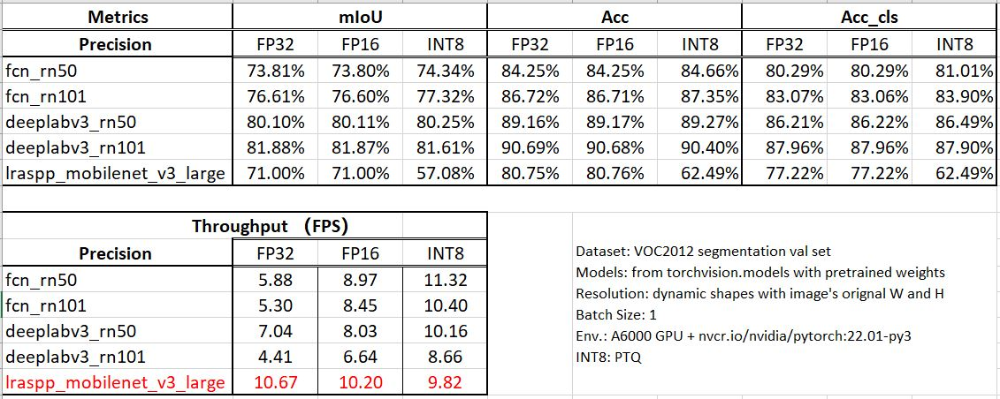
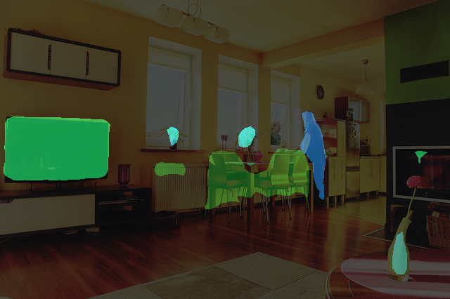

# Segmentation-models-benchmark
### Environment
1. nvcr.io/nvidia/tensorrt:22.01-py3
2. NVIDIA A6000 GPU

### Step-by-step
1. Using `python segmentation_torch2onnx.py` to select the torchvision model and convert it into onnx.
   The model can be selected through changeing the `mdoel_index` in line 52. Model list is shown below:
   ```   
   model_list = ['fcn_resnet50', #0 
                 'fcn_resnet101',#1
                 'deeplabv3_resnet50', #2
                 'deeplabv3_resnet101', #3 
                 'deeplabv3_mobilenet_v3_large', #4
                 'lraspp_mobilenet_v3_large' #5
                ]
   ```
2. Using `python segmentation_onnx2trt.py` to convert the onnx model into TensorRT engine. 
Through uncommenting the corresponding line from 89 to 94, the onnx model can be chosen.
   ```
   #model = "fcn_resnet50"
   #model = "fcn_resnet101"
   model = "deeplabv3_resnet50"
   #model = "deeplabv3_resnet101"
   #model = 'deeplabv3_mobilenet_v3_large'
   #model = 'lraspp_mobilenet_v3_large'
   ```
   The precision of TensorRT engine can be set by change line 107~109.
   ```
   #precision = 'fp32'
   #precision = 'fp16'
   precision = 'int8'
   ```
3. Using `python trt_infer.py` to run inference. 
   By changing line 262 `eval_mode = True/False`, you can switch inference mode between evaluation mode and normal inference mode.
   If you select the evaluation mode, you can specify evaluation dataset by modifying 
   the `val_file_name_list`, `row_file_path`, and `label_file_path` in `voc_reader` class of `load_gt.py`. 
   The validation dataset must be VOC format.
   

### Some results
1.Testing results 

2.Results visualization 

   

